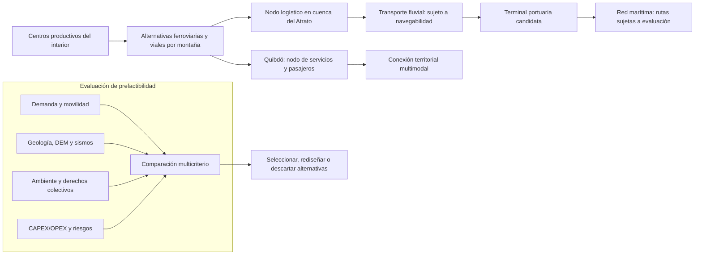

# Arquitectura conceptual de conectividad Chocó–Pacífico

```mermaid
flowchart LR
 INT[Centros productivos del interior] --> ALT[Alternativas ferroviarias y viales por montaña]
 ALT --> ATR[Nodo logístico en cuenca del Atrato]
 ATR --> RIV[Transporte fluvial: sujeto a navegabilidad]
 RIV --> PORT[Terminal portuaria candidata]
 ALT --> Q[Quibdó: nodo de servicios y pasajeros]
 Q --> COMM[Conexión territorial multimodal]
 PORT --> SEA[Red marítima: rutas sujetas a evaluación]
 subgraph SCREEN[Evaluación de prefactibilidad]
 DEM[Demanda y movilidad] --> MC[Comparación multicriterio]
 GEO[Geología, DEM y sismos] --> MC
 ENV[Ambiente y derechos colectivos] --> MC
 COST[CAPEX/OPEX y riesgos] --> MC
 end
 MC --> DEC[Seleccionar, rediseñar o descartar alternativas]
```

Los nodos no representan trazados georreferenciados ni infraestructura ferroviaria existente.
